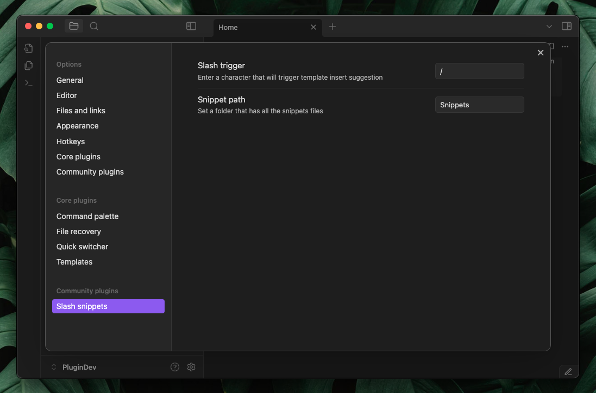
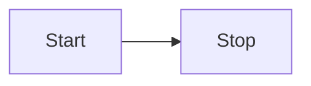

# Slash snippets 
Quickly insert your most-used text snippets while writing in Obsidian.
Perfect for things like Dataview blocks, callouts, templates, or any reusable text.


## Setup
- Pick a trigger character, by default, it’s / (slash).
- Enter the folder path where you'll keep all your text snippets.
- Set a folder path where you will be store all your text snippets.
- Turn on **Ignore properties** if you don’t want property values included when inserting snippets.
- Enable [Templater](https://github.com/SilentVoid13/Templater) support if you want to use Templater syntax inside snippets.
- Add your snippets to the folder you specified.




## Here are some inspirations for snippets 

**Callouts**

```
> [!faq]- Are callouts foldable?
> yes 
```

```
> [!success] 
> nice!
```

**3 col table**

```
| one | two | three |
| --- | --- | ----- |
|     |     |       |
|     |     |       |
```

**4 col table**

```
| 1   | 2   | 3   | 4   |
| --- | --- | --- | --- |
|     |     |     |     |
|     |     |     |     |
```

**Html snippets**

```
</br> </br>
```

```
<iframe src=" " height="400px" width="100%"></iframe>
```

**mermaid chart**

````

````


> **Also you can mix with [templater](https://github.com/SilentVoid13/Templater)  code to make powerful snippets**

**Iframe**

```
<iframe src="<% tp.file.cursor() %>" height="400px" width="100%"></iframe>
```

**Markdown comment**

```
<!-- <% tp.file.cursor() %> -->
```

**You can create some snippets named as today, yesterday and so on**

today

```
[[<%tp.date.now("YYYY-MM-DD")%>]] 
```

yesterday

```
[[<% tp.date.now("YYYY-MM-DD" ,-1) %>]]
```

last week

```
[[<% tp.date.now("YYYY-MM-DD" ,-7) %>]]
```

**Quick dataview**

````
```dataview
LIST FROM "<%tp.file.cursor()%>"
SORT file.mtim DESC
```
````


````
```dataview
TABLE 
<%tp.file.cursor(1)%>
FROM "<%tp.file.cursor()%>"

WHERE
<%tp.file.cursor(2)%>

SORT file.mtim DESC
```
````

**Progress bar for tasks in a note with inline dataview**

```
`= "<progress value='" + (length(filter(this.file.tasks.completed, (t) => t = true)) / length(this.file.tasks)) * 100 + "' max='100'></progress>" + "<br>" + round((length(filter(this.file.tasks.completed, (t) => t = true)) / length(this.file.tasks)) * 100) + "% completed"`
```


**List all backlinks**
````
## Backlinks
```dataview
LIST FROM [[<%tp.file.title%>]]
```
````


**List all outgoing links**

````
## Outlinks
```dataview
LIST
WITHOUT ID
file.link
FROM  "/"

WHERE 
contains(file.inlinks ,[[<%tp.file.title%>]] )

```
````


