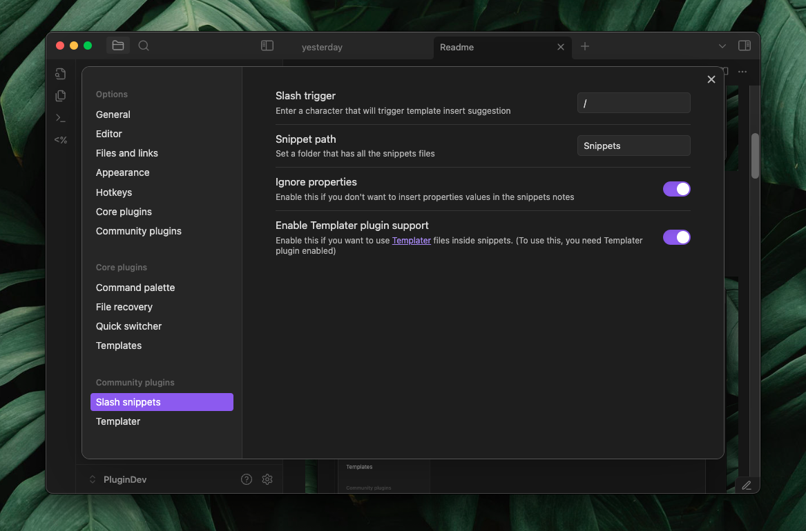

# Slash snippets 
Quickly insert your most-used text snippets while writing in Obsidian.
Perfect for things like Dataview blocks, callouts, templates, or any reusable text.


## Setup
- Pick a trigger character, by default, it’s / (slash).
- Enter the folder path where you'll keep all your text snippets.
- Set a folder path where you will be store all your text snippets.
- Turn on **Ignore properties** if you don’t want property values included when inserting snippets.
- Enable [Templater](https://github.com/SilentVoid13/Templater) support if you want to use Templater syntax inside snippets.
- Add your snippets to the folder you specified.



# How to install
Currently its under review , you can install using [BRAT plugin](https://github.com/TfTHacker/obsidian42-brat) or manually  
## Manual Installation
- Download `main.js` , `manifest.json` , `styles.css` the latest release from the [releases page](https://github.com/echo-saurav/slash-snippets-plugin/releases)
- create a folder name `slash-snippets-plugin` in `.obsidian/plugins`
- put all the file you downloaded in your vault's `.obsidian/plugins/slash-snippets-plugin/` directory
- Reload Obsidian
- Enable the plugin in Settings -> Community Plugins

## Here are some inspirations for snippets 

**Callouts**

```
> [!faq]- Are callouts foldable?
> yes 
```

```
> [!success] 
> nice!
```

**2 col table**
```
| 1   | 2   |
| --- | --- |
|     |     |

```


**3 col table**

```
| 1   | 2   | 3   |
| --- | --- | --- |
|     |     |     |

```

**4 col table**

```
| 1   | 2   | 3   | 4   |
| --- | --- | --- | --- |
|     |     |     |     |
|     |     |     |     |
```

**Html snippets**

```
</br> </br>
```

```
<iframe src=" " height="400px" width="100%"></iframe>
```

**mermaid chart**

````

````


## Also you can mix with [templater](https://github.com/SilentVoid13/Templater)  code to make powerful snippets**

**Iframe**

```
<iframe src="<% tp.file.cursor() %>" height="400px" width="100%"></iframe>
```

**Markdown comment**

```
<!-- <% tp.file.cursor() %> -->
```

**You can create some snippets named as today, yesterday and so on**

today

```
[[<%tp.date.now("YYYY-MM-DD")%>]] 
```

tomorrow

```
[[<% tp.date.now("YYYY-MM-DD" ,1) %>]] 
```

yesterday

```
[[<% tp.date.now("YYYY-MM-DD" ,-1) %>]]
```

last week

```
[[<% tp.date.now("YYYY-MM-DD" ,-7) %>]]
```

**Quick dataview**

````
```dataview
LIST FROM "<%tp.file.cursor()%>"
SORT file.mtim DESC
```
````


````
```dataview
TABLE 
<%tp.file.cursor(1)%>
FROM "<%tp.file.cursor()%>"

WHERE
<%tp.file.cursor(2)%>

SORT file.mtim DESC
```
````

**Progress bar for tasks in a note with inline dataview**

```
`= "<progress value='" + (length(filter(this.file.tasks.completed, (t) => t = true)) / length(this.file.tasks)) * 100 + "' max='100'></progress>" + "<br>" + round((length(filter(this.file.tasks.completed, (t) => t = true)) / length(this.file.tasks)) * 100) + "% completed"`
```


**List all backlinks**
````
## Backlinks
```dataview
LIST FROM [[<%tp.file.title%>]]
```
````


**List all outgoing links**

````
## Outlinks
```dataview
LIST
WITHOUT ID
file.link
FROM  "/"

WHERE 
contains(file.inlinks ,[[<%tp.file.title%>]] )

```
````


## AI Templates with [obsidian-ai-templater](https://github.com/TfTHacker/obsidian-ai-templater) plugin

**Answer question about the note**
```
<%*_
const content = tp.file.content
const userInput = await tp.system.prompt("What you want to write?")

let cleanContent = content.replace(/^-{3}[\s\S]*?-{3}\s*/gm, '');
cleanContent = cleanContent.replace(/<%\*_[\s\S]*?_%\>/g, '');
cleanContent = cleanContent.replace(/<%[\s\S]*?%\>/g, '');
cleanContent = cleanContent.trim();

const prompt = `
${userInput}
Do this based on the note bellow , 
---
${cleanContent}
--

Do not add any yaml for notes, only do or asked as user said. keep it simple and short
`
const aiWrite = await tp.ai.chat(prompt)

_%>
<% tp.file.cursor() %>
<% aiWrite %> 
```


**Make summery of current note**
```
<%*_
const content = tp.file.content

const prompt = `
Make a summery of the text bellow 
---
${content}
--

Only make summery dont make heading or anything else, your output will be inserted into a note , so write it as a note's summery sections. 
`
const summery = await tp.ai.chat(prompt)
_%>
## Summery
<% summery.trim() %>
```


**Make tasks list for notes**
```
<%*_
const content = tp.file.content

const prompt = `
Read this notes bellow carefully and make markdown tasks list based on what the notes talking about doing or planning 
---
${content}
--

Only make tasks dont make heading or anything else, your output will be inserted into a note , so write it as a note's ## Todo's sections, so you dont have to write heading for todo's, Only markdown task 
ex: 
- [ ] something 
`
const tasks = await tp.ai.chat(prompt)
_%>
## Todo's
<% tasks %>

```

**Mermaid chart**

```
<%*_
const content = tp.file.content

const prompt = `
Read this notes bellow carefully and make top down mermaid flowchart based on what the notes talking about, include key points the note says
---
${content}
--
`
const mermaidChart = await tp.ai.chat(prompt)
_%>
<% tp.file.cursor() %>
<% mermaidChart %> 
```


